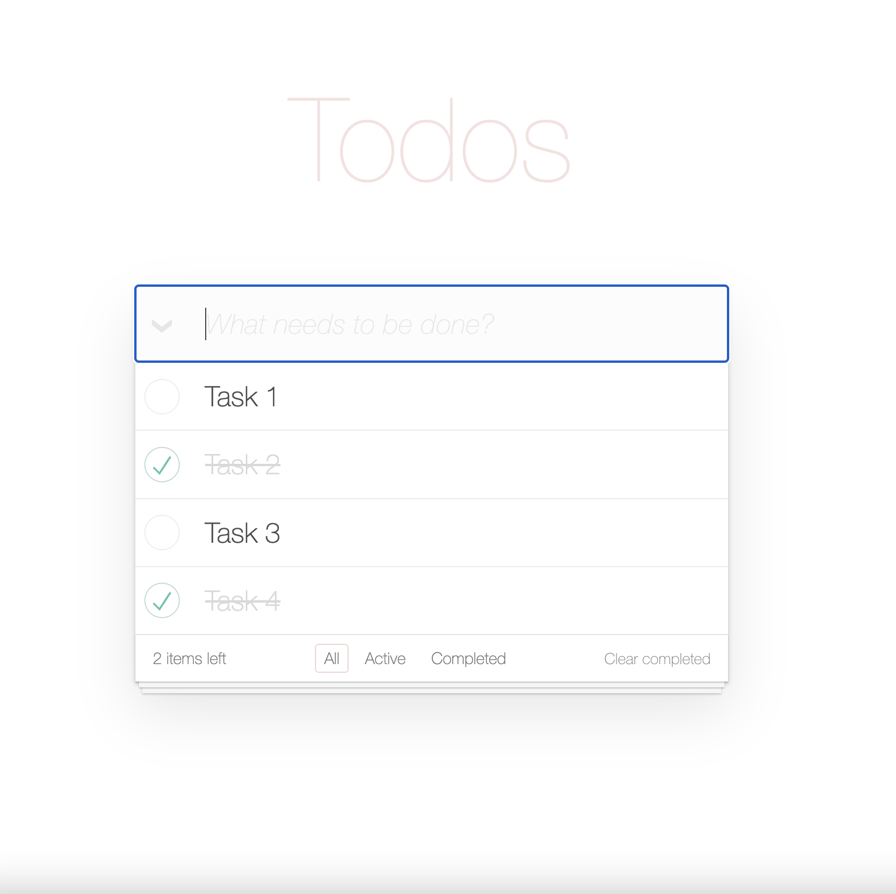
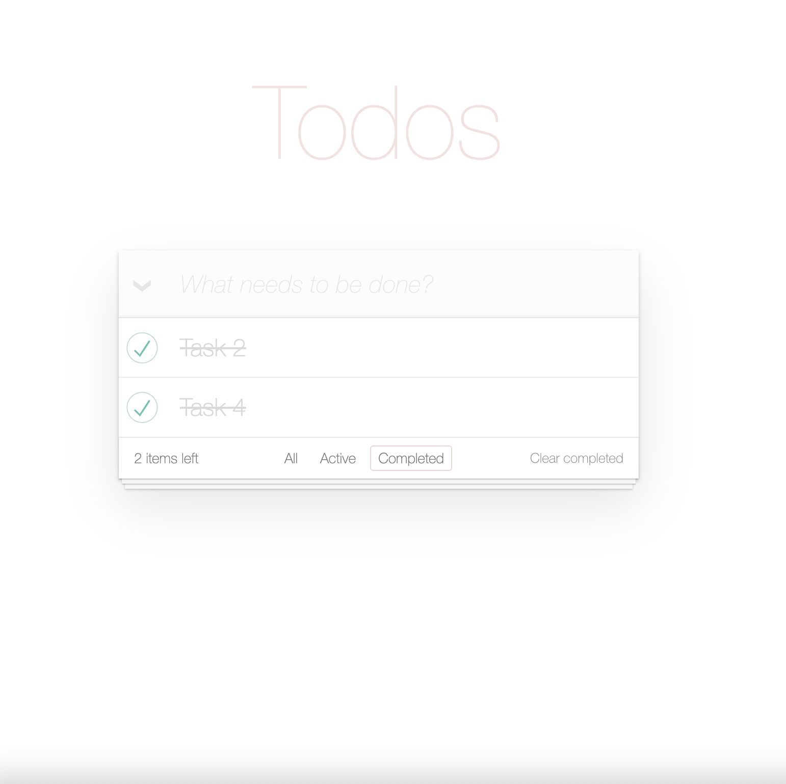
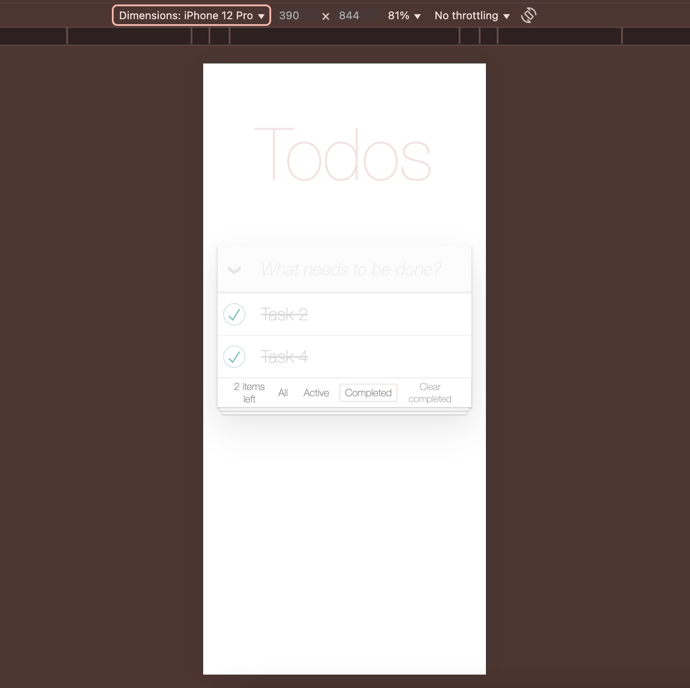

# Todo App

A modern, responsive Todo application built with React and TypeScript, featuring a clean UI and efficient state management.

## 📸 Screenshots

<div align="center">
  
  <p><em>Main view with todo list and filters</em></p>
  
  
  <p><em>Filtering options: All, Active, Completed</em></p>
  
  
  <p><em>Responsive design for mobile devices</em></p>
</div>

## 🌟 Features

- **Todo Management**

  - Add, edit, and delete todos
  - Mark todos as complete/incomplete
  - Bulk actions (complete all, clear completed)
  - Local storage persistence

- **Filtering & Organization**

  - Filter by status (All, Active, Completed)
  - Real-time filtering
  - Clear visual status indicators

- **Modern UI/UX**
  - Clean and intuitive interface using Bulma CSS
  - Responsive design for all devices
  - Loading states and error handling
  - Font Awesome icons integration
  - Accessibility-first approach with ARIA labels

## 🚀 Getting Started

### Prerequisites

- Node.js (v14 or higher)
- npm (v6 or higher)

### Installation

1. Clone the repository:

```bash
git clone https://github.com/czcoding/Todo-App.git
cd Todo-App
```

2. Install dependencies:

```bash
npm install
```

3. Start the development server:

```bash
npm run dev
```

The application will be available at `http://localhost:5173`

### Building for Production

To create a production build:

```bash
npm run build
```

### Deployment

The application is deployed to GitHub Pages. To deploy manually:

```bash
npm run deploy
```

## 🛠️ Tech Stack

- React 19
- TypeScript
- Locale Storage
- Context API
- SASS
- Bulma CSS
- Font Awesome
- GitHub Pages

## 📦 Project Structure

```
src/
├── components/     # Reusable UI components
│   ├── Header/    # Todo input and controls
│   ├── TodoList/  # Main todo list component
│   ├── TodoItem/  # Individual todo item
│   ├── Footer/    # Filters and bulk actions
│   └── Title/     # Application title
├── context/       # React context for state management
├── types/         # TypeScript type definitions
└── App.tsx        # Main application component
```

## 🔍 Usage

1. **Adding Todos**

   - Type your todo in the input field
   - Press Enter or click the add button

2. **Managing Todos**

   - Click the checkbox to mark as complete
   - Double-click to edit
   - Hover and click the delete button to remove

3. **Filtering**

   - Use the footer filters to show All/Active/Completed todos
   - Clear completed todos with the "Clear completed" button

4. **Bulk Actions**
   - Toggle all todos complete/incomplete
   - Clear all completed todos at once

## 🎯 Live Demo

Check out the live version at: [https://Artem-Brui.github.io/Todo-App/](https://Artem-Brui.github.io/Todo-App/)
